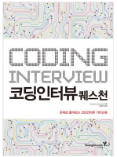
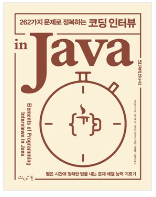
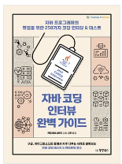
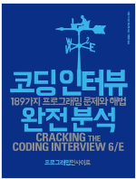
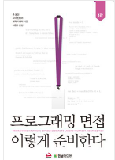
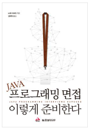
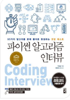
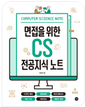
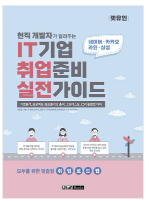

     
## 👨‍👩‍👦‍👦 우선

|  |  |  |  |  |  |
| ------------------------------------------------------------------------------------------------------------------------------ | ------------------------------------------------------------------------------------------------------------------------------ | ------------------------------------------------------------------------------------------------------------------------------ | ------------------------------------------------------------------------------------------------------------------------------ | ------------------------------------------------------------------------------------------------------------------------------ | ------------------------------------------------------------------------------------------------------------------------------ |
| [코딩인터뷰퀘스천](#코딩인터뷰퀘스천)   | [262가지문제로정복하는코딩인터뷰inJAVA](#262가지문제로정복하는코딩인터뷰inJAVA)    | [자바코딩인터뷰완벽가이드](#자바코딩인터뷰완벽가이드)  | [코딩인터뷰완벽분석](#코딩인터뷰완벽분석) | [프로그래밍면접이렇게준비한다](#프로그래밍면접이렇게준비한다)  | [자바프로그래밍면접이렇게준비한다](#자바프로그래밍면접이렇게준비한다)  |

     
## 👨‍👩‍👦‍👦 차선

|  |  |  | 
| ------------------------------------------------------------------------------------------------------------------------------ | ------------------------------------------------------------------------------------------------------------------------------ | ------------------------------------------------------------------------------------------------------------------------------ |  
| [파이썬알고리즘인터뷰](#파이썬알고리즘인터뷰) | [면접을위한cs전공지식노트](#면접을위한cs전공지식노트)    | [현직개발자가알려주는IT기업취업준비실전가이드](#현직개발자가알려주는IT기업취업준비실전가이드)  | 

