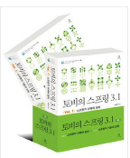
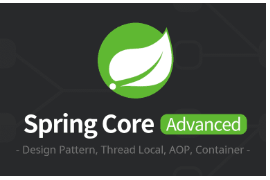
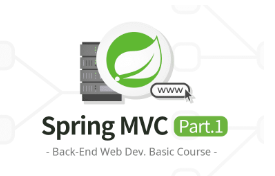
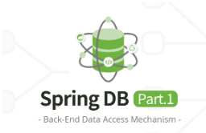
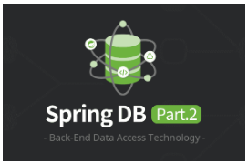
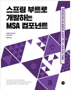
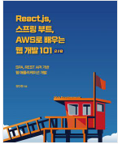

## 👨‍👩‍👦‍👦 전체참고

|  |  |  |  |  |  |
| ------------------------------------------------------------------------------------------------------------------------------ | ------------------------------------------------------------------------------------------------------------------------------ | ------------------------------------------------------------------------------------------------------------------------------ | ------------------------------------------------------------------------------------------------------------------------------ | ------------------------------------------------------------------------------------------------------------------------------ | ------------------------------------------------------------------------------------------------------------------------------ |
| [토비의 스프링](#토비의-스프링) | [스프링인액션](#스프링인액션) | [스프링5레시피](#스프링5레시피)  | [전문가를위한 스프링5](#전문가를위한-스프링5) | [배워서바로쓰는 스프링프레임워크](#배워서바로쓰는-스프링프레임워크)  | [스프링철저입문](#스프링철저입문)  |

 

 

## 👨‍👩‍👦‍👦 기초 및 시작 

#### 강의자료

|  |  |  |  |  |  |
| ------------------------------------------------------------------------------------------------------------------------------ | ------------------------------------------------------------------------------------------------------------------------------ | ------------------------------------------------------------------------------------------------------------------------------ | ------------------------------------------------------------------------------------------------------------------------------ | ------------------------------------------------------------------------------------------------------------------------------ | ------------------------------------------------------------------------------------------------------------------------------ |
| [스프링코어1](#스프링코어1)   | [스프링코어2](#스프링코어2)    | [스프링mcv1](#스프링mcv1)  | [스프링mcv2](#스프링mcv2) | [스프링DB1](#스프링DB1)  | [스프링DB2](#스프링DB2)  |

#### 스프링부트

|  |  |  |  |  |  |
| ------------------------------------------------------------------------------------------------------------------------------ | ------------------------------------------------------------------------------------------------------------------------------ | ------------------------------------------------------------------------------------------------------------------------------ | ------------------------------------------------------------------------------------------------------------------------------ | ------------------------------------------------------------------------------------------------------------------------------ | ------------------------------------------------------------------------------------------------------------------------------ |
| [스프링부트핵심가이드](#스프링부트핵심가이드)   | [스프링부트로개발하는msa컴포넌트](#스프링부트로개발하는msa컴포넌트)    | [스프링부트2레시피](#스프링부트2레시피)  | [실전스프링부트워크북](#실전스프링부트워크북) | [스프링부트코딩공작소](#스프링부트코딩공작소)  | [스프링부트로배우는자바웹개발](#스프링부트로배우는자바웹개발)  |

#### 스프링

|  |  |  |  |  |  |
| ------------------------------------------------------------------------------------------------------------------------------ | ------------------------------------------------------------------------------------------------------------------------------ | ------------------------------------------------------------------------------------------------------------------------------ | ------------------------------------------------------------------------------------------------------------------------------ | ------------------------------------------------------------------------------------------------------------------------------ | ------------------------------------------------------------------------------------------------------------------------------ |
| [초보웹개발자를위한스프링5프로그래밍 입문](#초보웹개발자를위한스프링5프로그래밍-입문)    | [스프링프레임워크첫걸음](#스프링프레임워크첫걸음)  | [스프링퀵스타트](#스프링퀵스타트) | [프로그래밍면접이렇게준비한다](#프로그래밍면접이렇게준비한다)  | [스프링4입문](#스프링4입문)  | [시작하세요스프링4프로그래밍](#시작하세요스프링4프로그래밍) | 

 

 

## 👨‍👩‍👦‍👦 리액티브중심

#### 강의자료

|  |  |  |  |  |  |
| ------------------------------------------------------------------------------------------------------------------------------ | ------------------------------------------------------------------------------------------------------------------------------ | ------------------------------------------------------------------------------------------------------------------------------ | ------------------------------------------------------------------------------------------------------------------------------ | ------------------------------------------------------------------------------------------------------------------------------ | ------------------------------------------------------------------------------------------------------------------------------ |
| [실전스프링5를활용한리액티브프로그래밍](#실전스프링5를활용한리액티브프로그래밍)   | [스프링부트실전활용마스터](#스프링부트실전활용마스터)    | [스프링부트2.0](#스프링부트2.0)  | [스프링mcv2](#스프링mcv2) | [스프링DB1](#스프링DB1)  | [스프링DB2](#스프링DB2)  |

 

 

## 👨‍👩‍👦‍👦 클라우드중심

#### 강의자료

|  |  |  |  |  |  |
| ------------------------------------------------------------------------------------------------------------------------------ | ------------------------------------------------------------------------------------------------------------------------------ | ------------------------------------------------------------------------------------------------------------------------------ | ------------------------------------------------------------------------------------------------------------------------------ | ------------------------------------------------------------------------------------------------------------------------------ | ------------------------------------------------------------------------------------------------------------------------------ |
| [마스터링스프링클라우드](#마스터링스프링클라우드)   | [스프링코어2](#스프링코어2)    | [스프링mcv1](#스프링mcv1)  | [스프링mcv2](#스프링mcv2) | [스프링DB1](#스프링DB1)  | [스프링DB2](#스프링DB2)  |

 

 

## 👨‍👩‍👦‍👦 마이크로서비스 중심 

#### 강의자료

|  |  |  |  |  |  |
| ------------------------------------------------------------------------------------------------------------------------------ | ------------------------------------------------------------------------------------------------------------------------------ | ------------------------------------------------------------------------------------------------------------------------------ | ------------------------------------------------------------------------------------------------------------------------------ | ------------------------------------------------------------------------------------------------------------------------------ | ------------------------------------------------------------------------------------------------------------------------------ |
| [스프링코어1](#스프링코어1)   | [스프링코어2](#스프링코어2)    | [스프링mcv1](#스프링mcv1)  | [스프링mcv2](#스프링mcv2) | [스프링DB1](#스프링DB1)  | [스프링DB2](#스프링DB2)  |

 

 

## 👨‍👩‍👦‍👦 튜토리얼 및 예제 중심 

#### 도서

|  |  |  |  |  |  |
| ------------------------------------------------------------------------------------------------------------------------------ | ------------------------------------------------------------------------------------------------------------------------------ | ------------------------------------------------------------------------------------------------------------------------------ | ------------------------------------------------------------------------------------------------------------------------------ | ------------------------------------------------------------------------------------------------------------------------------ | ------------------------------------------------------------------------------------------------------------------------------ |
| [코드로배우는스프링웹프로젝트(게시판)](#코드로배우는스프링웹프로젝트)   | [코드로배우는스프링부트웹프로젝트(게시판)](#코드로배우는스프링부트웹프로젝트)    | [누구나끝까지따라할수있는스프링부트퀵스타트(게시판)](#누구나끝까지따라할수있는스프링부트퀵스타트)  | [스프링부트시작하기(게시판,약간올드)](#스프링부트시작하기) | [예제로배우는스프링부트입문(게시판,매우올드)](#예제로배우는스프링부트입문)  | [짧고굵게배우는JSP웹프로그래밍과스프링프레임워크(뉴스기사관리웹서비스,매우올드)](#짧고굵게배우는JSP웹프로그래밍과스프링프레임워크)  |

|  |  |    |  |  | 
| ------------------------------------------------------------------------------------------------------------------------------ | ------------------------------------------------------------------------------------------------------------------------------ | ------------------------------------------------------------------------------------------------------------------------------ | ------------------------------------------------------------------------------------------------------------------------------ | ------------------------------------------------------------------------------------------------------------------------------ | 
| [처음배우는스프링부트2(게시판)](#코드로배우는스프링웹프로젝트)   | [채쌤의스프링부트프로젝트(게시판)](#코드로배우는스프링부트웹프로젝트)    | [스프링부트와AWS로혼자구현하는웹서비스 (1페이지블로그)](#스프링부트와AWS로혼자구현하는웹서비스)  | [백견불여일타스프링부트쇼핑몰프로젝트withJPA (쇼핑몰)](#백견불여일타스프링부트쇼핑몰프로젝트withJPA ) | [React.js, 스프링 부트, AWS로 배우는 웹 개발 101 (투두앱)](#리액트스프링부트aws)  | 

 

## [토비의 스프링] 

 

## [스프링인액션] 

 

### 스프링기초

1. 스프링 웹 ( 유효성검사)
2. 스프링 데이터
3. 스프링 시큐리티 (인메모리, jdbc기반, ldap 기반)
4. 구성 속성 사용 (지동구성 세부조정, 데이터소스, 내장서버, 로깅 등등) 

### 스프링통합

1. REST서비스 생성 및 사용 (Rest API,  RestTemplate, 하이퍼링크 사용하기)
2. 비동기 메시지 전송 (JMS, RabbitMQ, AMQP, 카프카) 
3. 스프링통합 (메시지통합, 필터, 변환기, 라우터, 분개기, 엑티베이터, 채널어뎁터..)
4. 리액티브스프링 (리액터,리액티브 API-스프링WebFlux,리액티브웹,리액티브데이터)
5. 클라우드네이티브스프링(마이크로서비스,구성관리,실패지원처리,모니터링)	

###	스프링배포

1. 스프링부트 액추에이터 사용 
2. 스프링관리(http 요청추적, 스레드모니터링, jmx로 스프링 모니터링)
3. 스프링배포(배포옵션) 

 

## [스프링5레시피] 

 

### 	(1단계: 스프링 기본개념 이해 및 개발화나경 설정) 
- 스프링 개발툴 
-  스프링 코어 

### 	(2단계: 기본이되는  웹 애플리케이션 부분)
- 스프링 MVC
- 스프링 REST
- 스프링 데이터엑세스
- 스트링테스트 

### 	(3단계: 보안, 트랜젝션,비동기처리 학습 ) 
- 스프링 MVC 비동기처리
- 스프링 시큐리티
- 스프링 트랜젝션 관리 

### 	(4단계: 데이터 연계처리, 메세징, 원격호출, NOSQL등 스프링 고급기능)
- 스프링 메세징
- 스프링 인테그레이션	
- 스프링 배치
- 스프링과 NoSQL
- 스프링 자바 엔터프라이즈 서비스의 원격 기술

### 	(5단계 기타)
-  스프링 소셜	
- 스프링 모바일
- 그레일즈 

 

## [전문가를 위한 스프링5] 

 

- 스프링 시작하기 (스프링 프레임워크 가져오기, 스프링 모듈 이해, 스프링 문서 사용  ) 
- 스프링 IoC와 DI 소개
-  스프링 구성 상세와 스프링 부트 (라이프사이클, 팩토리빈, 리소스접근, 프로파일 등등 )
-  스프링 AOP 소개
-  스프링 JDBC
- 스프링에서 하이버네이트 사용하기
- 스프링에서 JPA2로 데이터 액세스하기
- 트랜잭션 관리
- 타입 변환과 포매팅을 사용해 유효성 검증하기
- 태스크 스케줄링 (스프링의 테스크 스케줄링)
- 스프링 리모팅 사용하기(SingerService, JMS, Artemis 스타터,  RESTful-WS 사용, Castor XML 구성,  AMQP 사용하 )
- 스프링테스트 (로직단위테스트, 통합테스트, 프런트앤드 단위 테스트)
- 스프링에서 스크립트 언어 사용하기
- 애플리케이션모니터링( JMX, VisualVM으로 JMX 모니터링, 하이버네이트 통계 정보 모니터링 )
- 스프링웹애플리케이션 
- 웹소켓 (웹소켓 API,  STOMP로 메시지 전달) 
- 스프링 프로젝트: 배치, 인티그레이션, XD, 그리고 기타

 

## [배워서 바로 쓰는 스프링 프레임워크] 

 

	
- 스프링 프레임워크 소개 ( 스프링 모듈, IOC 컨테이너, 스프링의 장점, 간단한 스프링 애플리케이션 ,스프링 5의 새로운 내용  )
- 스프링 프레임워크 기초 (  생성자 기반 DI, 설정 정보를 빈에 전달,  빈 스코프)
- 빈 설정
- 의존 관계 주입
- 빈과 빈 정의 커스텀화하기 
- 애너테이션 기반 개발
- 자바 기반의 컨테이너 설정
- 스프링을 사용해 데이터베이스와 상호 작용하기
- 스프링데이터
- 스프링을 사용한 메시징, 전자우편, 비동기 메시지 실행, 캐싱
- AOP
- 스프링 웹 MVC 기초
- 스프링 웹 MVC를 활용한 검증과 데이터 바인딩
- 스프링 웹 MVC로 RESTful 웹 서비스 개발하기
- 스프링 웹 MVC 더 살펴보기
- 스프링 시큐리티를 사용한 애플리케이션 보안
- 자바 함수형 프로그래밍
-  RxJava 2를 사용한 반응형 프로그래밍
- 스프링 웹플럭스, 스프링 데이터, 스프링 시큐리티를 사용해 반응형 RESTful 웹 서비스 개발하기
	

 

## [스프링철저입문] 

 

■ 스프링이 만들어진 배경과 역사(1장)

■ 스프링 코어(2장)

■ 데이터 접근(3장, 10장, 11장)

■ 웹 애플리케이션(4장~7장, 9장, 12장)

■ 테스트(8장)

■ 스프링 부트(13장)

■ 스프링 배치(15장)

--------

 

## [스프링 부트 핵심 가이드] 

 

- 스프링부트란 (스프링핵심개념, 모듈, 스프링vs 스프링부트(의존성관리, 자동설정, 내장 was, 모니터링)) 
- 개발에 앞서 알면 좋은 기초 지식 (서버간통신, 스프링부트동작방식,레이어드아키텍처,디자인패턴,REST APi)
- 개발환경 구성 ()
- 스프링부트 애플리케이션 개발 (프로젝트생성, pom.xml, 기본 테스트)
- API 작성하는 다양한 방법(프로젝트 설정, REST API , Swagger로 REST API 문서 명세, 로깅 라이브러리)
- 데이터베이스 연동 (ORM, JPA, 하이버네이트)
- 테스트코드 작성하기 (Junit, Jacoco)
- Spring Data JPA 활용 (JPQL,  QueryDSL)
- 유효성 검사와 예외처리
- 엑추에이터 활용하기 
- 서버간 통신(RestTemplate, WebClient)
- 서비스의 인증과 권한 부여 (보안 용어 이해, 스프링 시큐리티, JWT)
	

 

## [스프링 부트 핵심 가이드] 

 

- 마이크로서비스 아키텍처 

- 프레임워크와 스프링부트 

- 스프링 애플리케이션 기본 

- 스프링 웹 MVC 개요

- 스프링 MVC를 이용한 REST-API 개발

- 웹 애플리케이션 서버 구축하기 
    - 웹 애플리케이션 기본 설정 : 웹 애플리케이션의 설정 메커니즘 / WebMvcConfigurer를 사용한 설정 / DispatcherServlet 설정
    - HttpMessageConverter와 REST-API 설정 ( HttpMessageConverter ,  ObjectMapper와 스프링 빈  )
    - Interceptor와 ServletFilter 설정 (  HandlerInterceptor 인터페이스, Filter 인터페이스)
    -  Application.properties 설정 : (@Value 애너테이션 @ConfigurationProperties와 @ConfigurationPropertiesScan)
    - Profile 설정 
    - REST-API와 국제화 메시지 처리 (message.properties 파일 설정 /MessageSource 인터페이스 / 스프링 부트 프레임워크의 자동 설정 구성 /LocaleResolver와 LocaleChangeInterceptor 설정 예제)
    - 로그설정 
    - 애플리케이션 패키징과 실행 (메이븐 패키징, 도커 이미지 생성) 
                    

- 스프링 AOP와 테스트, 자동 설정 원리  (스프링 AOP, 스프링부트 테스트)

- 데이터 영속성 (JPA 중심)

-  애플리케이션 통합: REST-API (RestTemplate 클래스(RestTemplate 구조, Connection Timeout과 Read Timeout 설정, keep-alive와 Connection Pool 설정 ), WebClient) 

- 레디스와 스프링 캐시 (레디스, 스프링 데이터 레디스,  스프링 프레임워크 캐시 

- 스프링 스케줄링 테스크 

- 스프링 이벤트 ( 스프링 이벤트, 비동기 사용자 정의, 트랜젝션 시점에 구독한 이베츠 처리)

 

## [스프링부트2레시피] 

 

- 스프링부트 소개 ( 메이븐으로, 그레들로, 이니셜라이즈로)
- 스프링부트기본 (빈구성, 속성외부화, 테스팅, 로깅구성, 기존 설정 재사용)
- 스프링 mvc (REST 리소스 노출, 타임리프, 예외처리, 국제화, 사용자 언어결정, 내장된 서버선택및 구성,서블릿 컨테이너에 SSL 구성)
- 스프링 MVC - 비동기 (컨트롤러와 TaskExecutor로 비동기 요청 처리, 응답작성, 웹소켓, STOMP와 웹소켓 )
- 스프링과 웹플럭스 (스프링 웹 플럭스로 반응형 애플리케이션 개발하기, 반응형 REST 서비스의 배포와 사용하기,  웹 플럭스와 웹 소켓) 
- 스프링 보안 ( )
- 데이터 처리 (데이터 소스, jdbc template, jpa, 하이버네이트)
- 자바 엔터프라이즈 서비스 (스프링 비동기 처리, 스프링 작업 스케줄링,  이메일 전송,  JMX MBean 등록)
- 메시징 (JMS, 래빗MQ   ) 
- 스프링 부트 액튜에이터 (스프링 부트 액튜에이터 활성화, 사용자 정의 상태 체크와 메트릭, 메트릭 내보내기 )
- 패키징 () 	

 

## [실전스프링부트워크북] 

 

-	스프링 부트 앱 처녀 개발
-	스프링 부트 자동 구성과 주요 기능
-	스프링 부트 CLI
-	스프링과 스프링 부트
-	스프링 부트 테스트
-	스프링 부트 데이터 액세스
-	스프링 부트 웹 개발
-	스프링 부트 보안
-	스프링 부트 메시징
- 	스프링 부트 액추에이터
-	스프링 부트 배포
-	스프링 부트 클라우드
-	스프링 부트 앱 확장

 

## [스프링 부트 코딩 공작소] 

 

 (너무 오래되긴함, 위의 두개를 보고 없는 요소를 참조하고 비교해보기)

- 스프링 시작하기 (스프링부트 핵심, 스프링부트 CLI, SpringInitializr) 
- 첫 번째 스프링 부트 애플리케이션 개발하기 (스프링 부트 프로젝트 살펴보기, 프로젝트 빌드 파헤치기 스타터 의존성 사용하기, 자동 구성 사용하기,  애플리케이션 실행하 )
- configure 커스터마이징 ( 스프링 부트 자동 구성 오버라이드하기 )
- 스프링 부트 테스트하기 ( )
- 스프링 부트 CLI로 그루비 시작하기
- 스프링 부트에 그레일즈 적용하기
- 액추에이터를 이용해 내부 들여다보기 
- 스프링 부트 애플리케이션 배포하기
- 부록 (스프링 부트 개발자 도구 , 스프링 부트 스타터 , 구성 프로퍼티 , 스프링 부트 의존성 ) 

 

## [스프링 부트로 배우는 자바 웹 개발] 

 

( 서블릿, 캐시 부분만 보자)

 (너무 오래되긴함, 위의 두개를 보고 없는 요소를 참조하고 비교해보기)

- 개발 환경의 변화와 자바

- 서블릿

- 스프링 프레임워크

- 스프링부트 웹개발 

- API 서버 만들기
 
- 스프링부트와 데이터 

- 커스텀 스프링부트 스타터 

 -예외 처리 및 테스트 

- 배포 

- 모니터링 

- 캐시 

- 회원관리

-----

스프링은 다보기보다는 초기 프로젝트 시작시 스프링부트와 어떤차이가 있는지 위주로

 

## [초보 웹 개발자를 위한 스프링5 프로그래밍 입문] 

 

- 들어가며 
- 스프링시작하기 
- 스프링 DI
- 의존 자동주입 
- 컴포넌트 스캔 
- 빈 라이프사이클과 범위 (컨테이너 초기화와 종료, 스프링 빈 객체의 라이프사이클, 빈 책체의 생성과 관리 범위) 
- AOP 프로그래밍 (프록시와 AOP, AOP구현, 프록시 생성방식) 
- DB 연동 (DataSource 설정,  JdbcTemplate을 이용한 쿼리 실행, 스프링의 익셉션 변환 처리,  트랜잭션 처리) 
- 스프링 MVC 시작하기
- 스프링 MVC 프레임워크 동작 방식 ( )
- MVC 1 : 요청 매핑, 커맨드 객체, 라다이렉트, 폼 태그, 모델
- MVC 2 : 메시지, 커맨드 객체 검증  ( 태그로 메시지 출력하기, 커맨드 객체의 값 검증과 에러 메시지 처리, 글로벌 범위 Validator와 컨트롤러 범위 Validator, Bean Validation을 이용한 값 검증 처리 )
- MVC 3 : 세션, 인터셉터, 쿠키 (로그인 처리를 위한 코드 준비, 컨트롤러에서 HttpSession 사용하기, 비밀번호 변경 기능 구현, 인터셉터 사용하기, 컨트롤러에서 쿠키 사용하기 )
- MVC 4 : 날짜 값 변환, @PathVariable, 익셉션 처리
- 간단한 웹 어플리케이션의 구조
- JSON 응답과 요청 처리
- 프로필과 프로퍼티 파일

 

## [스프링프레임워크첫걸음] 

 

( 쉬음, 초기 스프링 프로제트 시작 어떻게 하는지만) (코어, mvc, 타임리브,db,간단한앱개발) 

- 스프링 프레임워크 알아보기(스프링프레임워크 개요, 개발환경 구축 ) 
- 기초지식배우기 (자바지식, 웹 애플리케이션 필수지식, 롬북,그래들)
- 스프링 프레임워크핵심기능알아보기(DI, AOP, DI컨테이너, 에너테이션, Spring Initializr)
- 데이터베이스 작업 (앤티티, 리포지토리, 스프링데이터 JDBC사용해보기)
-  mvc 모델 알아보기
- 템플릿 엔진 알아보기 
- 요청 파라미터 취득하기
- 유효성검사 기능 알아보기
- 애플리케이션 만들기 ( OX 퀴즈)
	

 

## [스프링퀵스타트] 

 

좀 옛날느낌 (코어, mvc data) (스프링퀵스타트는 너무 예전, 나중에 시간나면 ) ( 쉬고 낡음, 초기 스프링 프로제트 시작 어떻게 하는지만)

- 환경구축 및 실습프로젝트 생성 

- 프레임워크 개요 (스프링프레임워크 특징, IOC 컨테이너)

-  스프링 컨테이너 및 설정 파일 (설정파일, 컨테이너 구동 및 테스트 )

- 의존성 주입

- 어노테이션 기반 설정 

- 스프링 AOP

-  스프링 JDBC

- 트랜잭션 처리

- 아키텍처로 게시판 개발 (모델1, 모델2)

- mvc 프레임워크 개발 및 적용 (게시판에 적용)

- 에너테이션기반 mvc 

- 검색 기능 추가 구현 / 파일 업로드 / 다국어처리 / 데이터 변환

- mybatis / mybatis 스프링 연동 / jpa /  jpa 스프링 연동

 

## [웹 개발자를 위한 Spring 4.0 프로그래밍] 

 

- 스프링 기초

	-  스프링 시작하기 ( 스프링 프레임워크 /설치 및 주요 모듈 / 첫 번째 스프링 프로그램)

	- 스프링 DI를 이용한 객체 생성

	- 빈 라이프사이클과 빈 범위
	
	- Environment, 프로퍼티, 프로필, 메시지
	
	-  확장 포인트와 PropertyEditor/ConversionService

	-  스프링 AOP

- 스프링 웹개발 1 

	- 스프링 MVC : 기본기
	
	- 스프링 MVC : 뷰 영역

	- 스프링 MVC : XML/JSON, 파일 업로드, 웹소켓

	- 스프링MVC : 기타 설정 (서블릿 3 기반 설정)

	- 데이터베이스 연동 
	
	-스프링 트렌젝션 관리

	- ORM 연동지원 (하이버네이트, jpa, 마이바티스)

	- 스프링 데이터 JPA 소개 

- 스프링 웹개발 2

	- 웹 애플리케이션 구조 

	- 스프링 시큐리티를 이용한 웹 보안 

	- 기타기능 (메일발송, 작업실행과 스케줄링)

	- 스프링 테스트 지원 

 

## [스프링4입문] 

 

- 스프링과 웹 애플리케이션 (스프링과 웹 애플리케이션 / 애플리케이션 아키텍처 / 프레젠테이션 층의 역할 / 비즈니스 로직 층의 역할 / 데이터 액세스 층의 역할 / 웹 애플리케이션이 안고 있는 문제 / 스프링 개요 ) 

- 스프링 DI

- 스프링 AOP

-  데이터 액세스 층의 설계와 구현

-  비즈니스 로직 층의 설계와 구현

- 프레젠테이션 층의 설계와 구현

- 인증, 인가 

- ORM 연계 - 하이버네이트, JPA, MyBatis

- 캐시 추상 기능 - Spring Cache

- 배치의 설계와 구현

-  클라우드 네이티브 입문

 

## [시작하세요 스프링 4 프로그래밍] 

 

(약간 복잡합 , MyBank 시스템을 발전시키면서 함 , 비동기, 캐시 지원 )

- 스프링 프레임워크 소개 

- 스프링 프레임워크 기초 

-빈 구성 

- 의존성 주입 

- 빈과 빈 정의의 사용자 지정 

- 스프링 어노테이션 기반 개발 

- 스프링을 이용한 데이터베이스와의 상호작용 

- 스프링을 이용한 메시징, 이메일전송, 비동기 메시지 실행 및 캐싱 

- 관점 지향 프로그래밍 

- 스프링 웹 MVC 기초 

- 스프링 웹 MVC에서의 유효성 검사 및 데이터 바인딩

- 스프링 웹 MVC를 이용한 RESTful 웹 서비스 개발

-  스프링 웹 MVC 활용 - 국제화, 파일 업로드 및 비동기 요청 처리

-  스프링 시큐리티를 이용한 애플리케이션의 보안 구현

 스프링 시큐리티를 이용한 애플리케이션의 보안 구현

---------
리액티브 중심 

 

## [실전스프링5를활용한리액티브프로그래밍]

 

▣ 01장: 왜 리액티브 스프링인가?

왜 리액티브인가?

__메시지 기반 통신

반응성에 대한 유스케이스

왜 리액티브 스프링인가?

__서비스 레벨에서의 반응성

요약

▣ 02장: 스프링을 이용한 리액티브 프로그래밍 - 기본 개념

리액티브를 위한 스프링 프레임워크의 초기 해법

__관찰자(Observer) 패턴

__관찰자 패턴 사용 예

__@EventListener를 사용한 발행-구독 패턴

__@EventListener 활용한 응용 프로그램 개발

리액티브 프레임워크 RxJava

__관찰자 + 반복자 = 리액티브 스트림

__스트림의 생산과 소비

__비동기 시퀀스 생성하기

__스트림 변환과 마블 다이어그램

__RxJava 사용의 전제 조건 및 이점

__RxJava를 이용해 애플리케이션 다시 만들기

리액티브 라이브러리의 간략한 역사

리액티브의 전망

요약

▣ 03장: 스트림의 새로운 표준 - 리액티브 스트림

모두를 위한 반응성

__API 불일치 문제

__풀 방식과 푸시 방식

__흐름 제어

__해결책

리액티브 스트림의 기본 스펙

__리액티브 스트림 동작해 보기

__리액티브 스트림 기술 호환성 키트(TCK)

__JDK 9

리액티브 스트림을 활용한 비동기 및 병렬 처리

리액티브 전망의 변화

__RxJava의 변화

__Vert.x의 적응

__Ratpack의 개선

__리액티브 스트림 기반의 MongoDB 드라이버

__리액티브 기술 조합

요약

▣ 04장: 리액터 프로젝트 - 리액티브 앱의 기초

리액터 프로젝트의 간략한 역사

__리액터 프로젝트 버전 1.x

__리액터 프로젝트 버전 2.x

리액터 프로젝트 필수 요소

__프로젝트에 리액터 추가하기

__리액티브 타입 - Flux와 Mono

__Flux와 Mono 시퀀스 만들기

__리액티브 스트림 구독하기

__연산자를 이용해 리액티브 시퀀스 변환하기

__코드를 통해 스트림 만들기

__에러 처리하기

__배압 다루기

__Hot 스트림과 cold 스트림

__시간 다루기

__리액티브 스트림을 조합하고 변환하기

__Processor

__리액터 프로젝트 테스트 및 디버깅하기

__리액터 추가 기능

리액터 프로젝트 심화학습

__리액티브 스트림의 수명 주기

__리액터에서 스레드 스케줄링 모델

__프로젝트 리액터의 내부 구조

요약

▣ 05장: 스프링 부트 2와 함께하는 리액티브

성공의 열쇠는 신속하게 출발하는 것

__Spring Roo를 사용해 애플리케이션 개발 속도 향상

__빠르게 성장하는 애플리케이션에 대한 핵심 요소로서의 스프링 부트

스프링 부트 2.0에서의 리액티브

__스프링 코어 패키지에서의 리액티브

__웹에서의 리액티브

__스프링 데이터에서의 리액티브

__스프링 세션에서의 리액티브

__스프링 시큐리티에서의 리액티브

__스프링 클라우드에서의 리액티브

__스프링 테스트에서의 리액티브

__리액티브 모니터링하기

요약

▣ 06장: 웹플럭스 - 비동기 논블로킹 통신

리액티브 기반 서버 기술의 핵심: 웹플럭스

__리액티브 웹의 핵심

__리액티브 웹 MVC 프레임워크

__웹플럭스로 구현하는 순수한 함수형 웹

__WebClient: 논블로킹을 지원하는 통신 클라이언트

__리액티브 웹소켓 API

__웹소켓 경량화를 위한 리액티브 SSE

__리액티브 템플릿 엔진

__리액티브 웹 보안

__다른 리액티브 라이브러리와의 상호 작용

웹플럭스 vs. 웹 MVC

__프레임워크를 비교할 때는 법칙이 중요하다

__철저한 분석과 비교

웹플럭스 애플리케이션

__마이크로서비스 기반 시스템

__접속이 느린 클라이언트를 처리하는 시스템

__스트리밍 또는 실시간 시스템

__웹플럭스 실제 사용해 보기

요약

▣ 07장: 리액티브 방식으로 데이터베이스 사용하기

최근 데이터 처리 패턴

__도메인 기반 설계

__마이크로서비스 시대의 데이터 저장소

__다중 저장소 영속화

__서비스로서의 데이터베이스

__마이크로서비스 사이의 데이터 공유

데이터 조회를 위한 동기식 모델

__데이터베이스 액세스를 위한 와이어 프로토콜

__데이터베이스 드라이버

__JDBC

__스프링 JDBC

__스프링 데이터 JDBC

__JPA

__스프링 데이터 JPA

__Spring Data NoSQL

__동기 모델의 한계

__동기 모델의 장점

스프링 데이터로 리액티브하게 데이터 접근하기

__MongoDB 리액티브 리포지토리

__리포지토리 동작 조합하기

__리액티브 리포지토리 동작 원리

__리액티브 트랜잭션

__스프링 데이터 리액티브 커넥터

__제약 사항과 기대되는 개선 사항

__ADBA(Asynchronous Database Access)

__R2DBC(Reactive Relational Database Connectivity)

동기식 리포지토리를 리액티브 스타일로 변경하기

__rxjava2-jdbc 라이브러리 사용하기

__동기식 CrudRepository 래핑하기

리액티브 스프링 데이터 실습하기

요약

▣ 08장: 클라우드 스트림으로 확장하기

메시지 브로커, 메시지 기반 시스템의 핵심

__서버사이드 로드 밸런싱

__스프링 클라우드와 Ribbon을 이용한 클라이언트 사이드 로드 밸런싱

__탄력적이고 신뢰성 있는 메시지 전달 계층 역할의 메시지 브로커

__메시지 브로커의 현황

스프링 생태계와 연결해주는 스프링 클라우드 스트림

클라우드 환경에서의 리액티브 프로그래밍

__스프링 클라우드 데이터 플로

__스프링 클라우드 펑션을 활용한 잘게 쪼개진 애플리케이션

__스프링 클라우드 - 데이터 플로의 일부로서의 함수

리액티브 메시지 전달을 위한 낮은 지연 시간의 RSocket

__RSocket vs. 리액터-네티

__자바에서 RSocket 사용

__RSocket vs. gRPC

__스프링 프레임워크에서 RSocket 사용

__다른 프레임워크에서의 RSocket

__RSocket 요약

요약

▣ 09장: 리액티브 애플리케이션 테스트하기

리액티브 스트림을 테스트하기 어려운 이유

StepVerifier를 이용한 리액티브 스트림 테스트

__StepVerifier의 핵심 요소

__StepVerifier를 이용한 고급 테스트

__가상 시간 다루기

__리액티브 컨텍스트 검증하기

__웹플럭스 테스트

__WebTestClient를 이용해 컨트롤러 테스트하기

__웹소켓 테스트

요약

▣ 10장: 자! 드디어 릴리즈다

데브옵스(DevOps) 친화적인 앱의 중요성

리액티브 스프링 애플리케이션 모니터링

__스프링 부트 액추에이터(Spring Boot Actuator)

__마이크로미터(Micrometer)

__리액티브 스트림 모니터링하기

__스프링 클라우드 슬루스를 사용한 분산 추적

__미려한 UI를 지원하는 스프링 부트 어드민 2.x

클라우드에 배포하기

__아마존 웹서비스에 배포하기

__구글 쿠버네티스 엔진에 배포하기

__Pivotal Cloud Foundry에 배포하기

__쿠버네티스와 Istio를 넘어 FaaS를 위한 Knative

__성공적인 애플리케이션 배포를 위한 조언

요약

 

## [스프링부트실전활용마스터]

	::: 스프링 부트 개발, 테스트, 문서화, 보안, 도커화, 운영까지 모두를 한 권에 마스터

	
    ::: 손쉬운 이커머스 예제를 따라 해보면서 당장 바로 활용 가능한 스프링 부트(Spring Boot), 스프링 
    웹플럭스(WebFlux), 리액티브 프로그래밍(Reactive programming)
	
    ::: 장바구니 예제를 리액터(Reactor)를 활용한 논블로킹/비동기 방식으로 구현
	
    ::: 스프링 헤이티오스(HATEOAS)를 적용해서 변경 여파를 최소화하면서 진화하는 API
	
    ::: 스프링 레스트 독(REST Docs)을 사용해서 소스 코드와 일치하는 API 문서를 작성
	
    :::  AMQP 메시징을 활용해서 느슨하게 연결된 이벤트 중심 아키텍처를 구현
	
    :::  양방향 리액티브 프로토콜인 R소켓을 사용해서 HTTP보다 효율적인 최신 네트워크 프로그래밍 기법
	
    ::: 리액티브 스트림 구현체인 리액터와 이를 활용한 스프링 웹플럭스
	
    ::: 어려운 리액터 디버깅을 도와주는 리액터 디버깅 도구
	
    ::: 운영 효율을 높여주는 스프링 부트 액추에이터
	
    ::: 하이퍼미디어를 활용해서 진화하는 API 작성을 도와주는 스프링 헤이티오스
	
    ::: 템플릿을 사용해서 쉽게 개발할 수 있는 스프링 부트 메시징
	
    ::: 리액티브 프로그래밍을 활용해서 고성능 소켓 프로그래밍을 가능하게 해주는 R소켓

- 스프링 부트 웹 애플리케이션 만들기 (리엑트프 프로그래밍, 리액터, 웹플럭스, 스프링웹플럭스 컨트롤러 생성)
- 스프링 부트를 활용한 데이터 액세스5 (리액티브 데이터 스토어 요건 ) 
- 스프링 부트 개발자 도구 (개발자 도구: 자동 재시작과 리로딩_정적 자원 제외_개발 모드에서 캐시 비활성화_부가적 웹 활동 로깅_자동설정에서의 로깅 변경_라이브 리로드 지원, 리액터 개발자 도구: 리액터 플로우 디버깅___리액터 플로우 로깅___블록하운드를 사용한 블로킹 코드 검출)
- 스프링 부트 테스트 (리액티브 단위 테스트 작성/내장 컨테이너 테스트 실행/스프링 부트 슬라이스 테스트/블록하운드 사용 단위 테스트)
- 스프링 부트 운영 (배포, 운영 애플리케이션 관리, 운영 데이터 확인)
- 스프링 부트 API 서버 구축
- 스프링 부트 메시징
- 스프링 부트 R소켓 (R소켓 소개- 리액티브 프로토콜 탄생)
- 스프링 부트 애플리케이션 보안

 

 

## [스프링부트2.0] 

 

1장. 자바로 빠른 시작

__시작하기

__스프링 부트 스타터

__스프링 부트 애플리케이션 실행

__스프링 부트의 속성 지원에 대해 알아보기

__애플리케이션을 실행 가능한 JAR 파일로 묶기

__클라우드 파운드리에 배포

__프로덕션-준비 지원 추가

____일반적인 헬스를 위한 앱 핑(Pinging)

____매트릭스

__요약

2장. 스프링 부트 리액티브 웹

__스프링 이니셜라이저를 이용한 리액티브 웹 
애플리케이션 생성하기

__리액티브 프로그래밍의 원리 배우기

__리액터 타입 소개

__임베디드 네티에서 아파치 톰캣으로 전환

__리액티브 스프링 웹 플럭스와 고전적인 스프링 MVC 
비교하기

____왜 스프링이 이것을 하고 있는가?

__모노/플럭스-기반 엔드포인트 표시

__리액티브 ImageService 생성하기

__리액티브 파일 컨트롤러 생성하기

__리액티브 프로그래밍을 사용해야 하는 이유

__타임리프 템플릿과 상호 작용

__비동기에서 동기화로 이동하는 방법을 설명하는 것은 쉽지만, 그 반대는 아니다

__요약

3장. 스프링 부트를 이용한 리액티브 데이터 액세스

__리액티브 데이터 저장소를 사용해 진행

__문제 해결

____스프링 부트로 스프링 데이터 저장소 연결하기

__리액티브 저장소 생성

__모노/플럭스 및 오퍼레이션 체인을 통해 데이터 
가져오기

__커스텀 파인더 생성하기

__Example로 쿼리하기

__MongoOperations로 쿼리하기

__리액티브 오퍼레이션 로깅

__요약

4장. 스프링 부트 테스트

__테스트 의존성

__단위 테스팅

__슬라이스-기반 테스팅

____임베디드 몽고 DB로 테스팅

____실제 몽고 DB 데이터베이스로 테스팅

__웹 플럭스 컨트롤러 테스팅

__임베디드 스프링 부트 앱 테스트

__커스텀 스프링 부트 자동 설정 테스팅

__요약

5장. 스프링 부트 앱을 위한 개발자 도구

__핫 코드 리로딩을 위해 스프링 부트의 DevTools 사용

__스프링 부트의 자동 설정 보고서 사용

__로컬 변경 및 대상 시스템에서 보기

__커스텀 헬스 체크 작성

__/application/info에 빌드 데이터 추가

__커스텀 매트릭스 생성

__추가 액추에이터 엔드포인트 작업

__요약

6장. 스프링 부트로 AMQP 메시징하기

__래빗MQ 시작하기

____래빗MQ 브로커 설치

____래빗MQ 브로커 시작

__기존 애플리케이션에 메시징을 새로운 컴포넌트로 추가

__메시지 생성자/메시지 소비자 생성하기

____코멘트 표시

____코멘트 작성

____AMQP 기본 사항

__메시지 플로를 추적하는 커스텀 매트릭스 추가

__스프링 클라우드 스트림(래빗MQ 포함)에서 엿보기

____스프링 클라우드 소개

____스프링 클라우드 스트림을 이용한 로깅

__요약

7장. 스프링 부트의 마이크로서비스

__마이크로서비스에 대한 간단한 입문서

__유레카를 사용해 동적으로 서비스를 등록 및 검색

__@SpringCloudApplication 소개

__클라이언트-사이드 로드 밸런싱을 통해 다른 
마이크로서비스를 호출

__마이크로서비스 서킷 브레이커 구현

__서킷 모니터링

__마이크로서비스 설정을 컨피그 서버로 오프로드

__요약

8장. 스프링 부트의 웹 소켓

__저장된 코멘트를 채팅 서비스에 게시하기

__웹 소캣 트래픽을 처리하기 위한 채팅 서비스 생성하기

____웹 소캣 메시지 중개

____저장된 코멘트 브로드캐스트

____웹 소캣 핸들러 구성

__웹 페이지에서 웹 소켓 메시지 소비

__완전 비동기식 웹 클라이언트로 이동

__서버에서 AJAX 호출 처리

__사용자 채팅 소개

__사용자별 메시지 보내기

____인증 없이 사용자 등록

____사용자를 세션에 연결

____사용자 간 메시지 보내기

__최종 제품 체크 아웃

__JSR 356 대 스프링 WebFlux 메시징

__요약

9장. 스프링 부트로 앱 보안

__스프링 부트 애플리케이션 보안

__스프링 세션 사용하기

____게이트웨이 API 작성

__채팅 마이크로서비스 보안

____인증 대 권한 부여

__다른 마이크로서비스와 세션 세부 정보 공유

__이미지 마이크로서비스 보안

__이미지 소유권 연결

____인증 메서드

__권한 부여 확인을 사용해 UI 조정

__웹 소켓 보안

__통신 추적

__컨피그 서버 보안

__유레카 서버 보안

__요약

10장. 스프링 부트로 앱 프로덕션하기

__프로파일-기반 빈 세트

__설정 등록 정보 빈 생성

__프로덕션 환경 설정 오버라이딩

____@ConfigurationProperties 대 @Value

__앱을 클라우드 파운더리에 푸시하고 설정 조정

__요약

 

## [튜토리얼 목록정리] 

 

1. 코드로 배우는 스프링 웹 프로젝트 (게시판 ) 

1. 코드로 배우는 스프링부트 웹 프로젝트  (게시판) 

1. 누구나 끝까지 따라 할 수 있는 스프링 부트 퀵스타트  (게시판 구현)

	- 테스트와 로깅, 빌드
	- JPA 퀵스타트
	- 타임리프 
	- 사용자 인증과 예외처리
	- 스프링 부트 시큐리티
	-  웹 애플리케이션 통합

1-. 스프링 부트 시작하기 (차근차근 따라 하는 단계별 실습)      -- 약간 올드함 

	- 게시판 구현 

1--. 예제로 배우는 스프링 부트 입문					-- 매우 올드함 

	- 게시판 구현 
	- JSP, Oracle, MyBatis와 연동

1--. 짧고 굵게 배우는 JSP 웹 프로그래밍과 스프링 프레임워크        -- 매우 올드함 

	- 뉴스 기산 관리 웹 서비스 

2. 처음 배우는 스프링 부트 2  (커뮤니티게시판)

	- 커뮤니티 게시판 기능 고안하기 + 스프링 부트로 커뮤니티 게시판 설계하기
	- 스프링 부트 스타터 들여다보기

	- 스프링 부트 테스트
 	-  스프링 부트 웹
	- 스프링 부트 시큐리티 + OAuth2
	- 스프링 부트 데이터 레스트
	-  스프링 부트 배치 , Spring Data REST

3. 채쌤의 스프링부트 프로젝트  ( 게시판 애플리케이션 )

	- 스프링 시큐리티 
	-  OAuth의 개념과 카카오 인증 설정
	- AWS 이용하기
	-
	-
	-

3. 스프링부트와 AWS로 혼자 구현하는 웹 서비스  ( 1 페이지 블로그)

	- 테스트코드 작성 
	- Spring Data JPA
	- 머스태치
	-  스프링 시큐리티와 OAuth 2.0으로 로그인 기능 구현하기
	- AWS 서버 환경을 만들어보자 - AWS EC2
	-  AWS에 데이터베이스 환경을 만들어보자 - AWS RDS
	-  EC2 서버에 프로젝트를 배포해 보자
	- 코드가 푸시되면 자동으로 배포해 보자 - Travis CI 배포 자동화
	- 24시간 365일 중단 없는 서비스를 만들자

4. 백견불여일타 스프링 부트 쇼핑몰 프로젝트 with JPA  ( 쇼핑몰) 

	- Spring Data JPA
	- Thymeleaf
	-  스프링 시큐리티를 이용한 회원 가입 및 로그인
	

5. React.js, 스프링 부트, AWS로 배우는 웹 개발 101  (투두앱, 스프링 리액트 통합, AWS ) 

	

 

## [불필요] 

 
스프링 5 마스터 2/e  (확인)

스프링 부트 시작하기 (차근차근 따라 하는 단계별 실습)

코드로 배우는 스프링 부트 웹 프로젝트 (구멍가게 코딩단)

[국내도서] 예제로 배우는 스프링 부트 입문

[국내도서] 처음 배우는 스프링 부트 2

스타트 스프링부트

스프링을 이용한 RESTful 웹 서비스 구축하기

스프링 애플리케이션 개발

프로스프링3

스프링프레임워크의 실체  (목차가 너무  상세해서 좋음)

스프링 애플리케이션 개발 

스프링을 이용한 restful 웹서비스 구축하기 