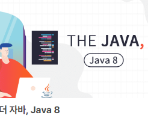
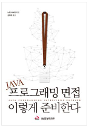
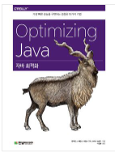
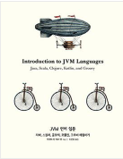

     
## 👨‍👩‍👦‍👦 우선

|  |  |  |  |  |  |
| ------------------------------------------------------------------------------------------------------------------------------ | ------------------------------------------------------------------------------------------------------------------------------ | ------------------------------------------------------------------------------------------------------------------------------ | ------------------------------------------------------------------------------------------------------------------------------ | ------------------------------------------------------------------------------------------------------------------------------ | ------------------------------------------------------------------------------------------------------------------------------ |
| [자바8인액션](#자바8인액션)   | [모던자바인액션](#모던자바인액션)    | [이펙티브자바](#이펙티브자바)  | [가장 빨리 만나는 코어 자바9](#코어자바9) | [더자바8](#더자바8)  | [더자바코드조작](#더자바코드조작)  |

     
## 👨‍👩‍👦‍👦 성능 및 최적화 

|  |  |  |  | 
| ------------------------------------------------------------------------------------------------------------------------------ | ------------------------------------------------------------------------------------------------------------------------------ | ------------------------------------------------------------------------------------------------------------------------------ | ------------------------------------------------------------------------------------------------------------------------------ | 
| [자바프로그래밍면접이렇게준비한다](#자바8인액션)   | [개발자가반드시알아야할자바성능튜닝이야기](#모던자바인액션)    | [자바최적화](#이펙티브자바)  | [자바성능튜닝](#코어자바9) | 

     
## 👨‍👩‍👦‍👦 분류1 

|  |  |  | 
| ------------------------------------------------------------------------------------------------------------------------------ | ------------------------------------------------------------------------------------------------------------------------------ | ------------------------------------------------------------------------------------------------------------------------------ |  
| [스프링입문을 위한 자바 객체 지향의 원리와 이해 ](#자바8인액션)   | [자바9 모듈화](#모던자바인액션)    | [JVM 언어 입문 ](#이펙티브자바)  | 

     
## 👨‍👩‍👦‍👦 분류2

|  |  | 
| ------------------------------------------------------------------------------------------------------------------------------ | ------------------------------------------------------------------------------------------------------------------------------  
| [RxJava리액티브프로그래밍 ](#자바8인액션)   | [RxJava를활용한리액티브프로그래밍](#모던자바인액션)    |  

     
## 👨‍👩‍👦‍👦 분류3 

|  |  | 
| ------------------------------------------------------------------------------------------------------------------------------ | ------------------------------------------------------------------------------------------------------------------------------ | 
| [자바네트워크프로그래밍](#자바네트워크프로그래밍)   | [자바9 모듈화](#자바병렬프로그래밍)  | 

 
  
     

<!--     -->
<!--     -->

   ## [자바8인액션]

1장. 자바 8을 눈여겨봐야 하는 이유

__1.1 왜 아직도 자바는 변화하는가?

__1.2 자바 함수

__1.3 스트림

__1.4 디폴트 메서드

__1.5 함수형 프로그래밍에서 가져온 다른 유용한 아이디어

__1.6 요약

 

2장. 동작 파라미터화 코드 전달하기

__2.1 변화하는 요구사항에 대응하기

__2.2  동작 파라미터화  

__2.3 복잡한 과정 간소화

__2.4 실전 예제

__2.5 요약

 

3장. 람다 표현식

__3.1 람다란 무엇인가

__3.2 어디에, 어떻게 람다를 사용할까?

__3.3 람다 활용: 실행 어라운드 패턴

__3.4 함수형 인터페이스 사용

__3.5 형식 검사, 형식 추론, 제약

__3.6 메서드 레퍼런스

__3.7 람다, 메서드 레퍼런스 활용하기!

__3.8 람다 표현식을 조합할 수 있는 유용한 메서드

__3.9 비슷한 수학적 개념

__3.10 요약

 

<2부 함수형 데이터 처리>

 

4장. 스트림 소개

__4.1 스트림이란 무엇인가?

__4.2 스트림 시작하기

__4.3 스트림과 컬렉션

__4.4 스트림 연산

__4.5 요약

 

5장. 스트림 활용

__5.1 필터링, 슬라이싱

__5.2 매핑

__5.3 검색과 매칭

__5.4 리듀싱

__5.5 모든 기법 활용

__5.6 숫자형 스트림

__5.7 스트림 만들기

__5.8 요약

 

6장. 스트림과 데이터 수집

__6.1 컬렉터란 무엇인가?

__6.2 리듀싱과 요약

__6.3 그룹화

__6.4 분할

__6.5 Collector 인터페이스

__6.6 커스텀 컬렉터를 구현해서 성능 개선하기

__6.7 요약

 

7장. 병렬 데이터 처리와 성능

__7.1 병렬 스트림

__7.2 포크/조인 프레임워크

__7.3 Spliterator

__7.4 요약

 

<3부 효과적인 자바 8 프로그래밍>

 

8장. 리팩토링, 테스팅, 디버깅

__8.1 가독성과 유연성을 개선하는 리팩토링

__8.2 람다로 객체지향 디자인 패턴 리팩토링하기

__8.3 람다 테스팅

__8.4 디버깅

__8.5 요약

 

9장. 디폴트 메서드

__9.1 변화하는 API

__9.2 디폴트 메서드란 무엇인가?

__9.3 디폴트 메서드 활용 패턴

__9.4 해결 규칙

__9.5 요약

 

10장. null 대신 Optional

__10.1 값이 없는 상황을 어떻게 처리할까?

__10.2 Optional 클래스 소개

__10.3 Optional 적용 패턴

__10.4 Optional을 사용한 실제 예제

__10.5 요약

 

11장.    CompletableFuture: 조합할 수 있는 비동기 프로그래밍 

__11.1 Futures

__11.2 비동기 API 구현

__11.3 비블록 코드 만들기

__11.4 비동기 작업 파이프라인 만들기

__11.5 CompletableFuture의 종료에 대응하는 방법

__11.6 요약

 

12장. 새로운 날짜, 시간 API

__12.1 LocalDate, LocalTime, Instant, Duration, Period

__12.2 날짜 조정, 파싱, 포매팅

__12.3 다양한 시간대와 캘린더 활용 방법

__12.4 요약

 

<4부 자바 8의 한계를 넘어서>

 

13장. 함수형 관점으로 생각하기

__13.1 시스템 구현과 유지보수

__13.2 함수형 프로그래밍이란 무엇인가?

__13.3 재귀와 반복

__13.4 요약

 

14장. 함수형 프로그래밍 기법

__14.1 함수는 모든 곳에 존재한다

__14.2 영속 자료구조

__14.3 스트림과 게으른 평가

__14.4 패턴 매칭

__14.5 기타 정보

__14.6 요약

 

15장. OOP와 FP의 조화: 자바 8과 스칼라 비교

__15.1 스칼라 소개

__15.2 함수

__15.3 클래스와 트레이트

__15.4 요약

16장. 결론 그리고 자바의 미래

__16.1 자바 8의 기능 리뷰

__16.2 자바의 미래

__16.3 결론

부록 A 기타 언어 업데이트
부록 B 기타 라이브러리 업데이트
부록 C 스트림에 여러 연산 병렬로 실행하기
부록 D 람다와 JVM 바이트코드

     

   ## [모던자바인액션 -(1순위)]

   [ PART I 기초 ]

CHAPTER 1 자바 8, 9, 10, 11 : 무슨 일이 일어나고 있는가?

1.1 역사의 흐름은 무엇인가?

1.2 왜 아직도 자바는 변화하는가?

1.3 자바 함수

1.4 스트림

1.5 디폴트 메서드와 자바 모듈

1.6 함수형 프로그래밍에서 가져온 다른 유용한 아이디어

1.7 마치며

 

CHAPTER 2 동작 파라미터화 코드 전달하기

2.1 변화하는 요구사항에 대응하기

2.2 동작 파라미터화

2.3 복잡한 과정 간소화

2.4 실전 예제

2.5 마치며

 

CHAPTER 3 람다 표현식

3.1 람다란 무엇인가?

3.2 어디에, 어떻게 람다를 사용할까?

3.3 람다 활용 : 실행 어라운드 패턴

3.4 함수형 인터페이스 사용

3.5 형식 검사, 형식 추론, 제약

3.6 메서드 참조

3.7 람다, 메서드 참조 활용하기

3.8 람다 표현식을 조합할 수 있는 유용한 메서드

3.9 비슷한 수학적 개념

3.10 마치며

 

[ PART II 함수형 데이터 처리 ]

 

CHAPTER 4 스트림 소개

4.1 스트림이란 무엇인가?

4.2 스트림 시작하기

4.3 스트림과 컬렉션

4.4 스트림 연산

4.5 로드맵

4.6 마치며

 

CHAPTER 5 스트림 활용

5.1 필터링

5.2 스트림 슬라이싱

5.3 매핑

5.4 검색과 매칭

5.5 리듀싱

5.6 실전 연습

5.7 숫자형 스트림

5.8 스트림 만들기

5.9 마치며

 

CHAPTER 6 스트림으로 데이터 수집

6.1 컬렉터란 무엇인가?

6.2 리듀싱과 요약

6.3 그룹화

6.4 분할

6.5 Collector 인터페이스

6.6 커스텀 컬렉터를 구현해서 성능 개선하기

6.7 마치며

 

CHAPTER 7 병렬 데이터 처리와 성능

7.1 병렬 스트림

7.2 포크/조인 프레임워크

7.3 Spliterator 인터페이스

7.4 마치며

 

[ PART III 스트림과 람다를 이용한 효과적 프로그래밍 ]

 

CHAPTER 8 컬렉션 API 개선

8.1 컬렉션 팩토리

8.2 리스트와 집합 처리

8.3 맵 처리

8.4 개선된 ConcurrentHashMap

8.5 마치며

 

CHAPTER 9 리팩터링, 테스팅, 디버깅

9.1 가독성과 유연성을 개선하는 리팩터링

9.2 람다로 객체지향 디자인 패턴 리팩터링하기

9.3 람다 테스팅

9.4 디버깅

9.5 마치며

 

CHAPTER 10 람다를 이용한 도메인 전용 언어

10.1 도메인 전용 언어

10.2 최신 자바 API의 작은 DSL

10.3 자바로 DSL을 만드는 패턴과 기법

10.4 실생활의 자바 8 DSL

10.5 마치며

 

[ PART IV 매일 자바와 함께 ]

 

CHAPTER 11 null 대신 Optional 클래스

11.1 값이 없는 상황을 어떻게 처리할까?

11.2 Optional 클래스 소개

11.3 Optional 적용 패턴

11.4 Optional을 사용한 실용 예제

11.5 마치며

 

CHAPTER 12 새로운 날짜와 시간 API

12.1 LocalDate, LocalTime, Instant, Duration, Period 클래스

12.2 날짜 조정, 파싱, 포매팅

12.3 다양한 시간대와 캘린더 활용 방법

12.4 마치며

 

CHAPTER 13 디폴트 메서드

13.1 변화하는 API

13.2 디폴트 메서드란 무엇인가?

13.3 디폴트 메서드 활용 패턴

13.4 해석 규칙

13.5 마치며

 

CHAPTER 14 자바 모듈 시스템

14.1 압력 : 소프트웨어 유추

14.2 자바 모듈 시스템을 설계한 이유

14.3 자바 모듈 : 큰 그림

14.4 자바 모듈 시스템으로 애플리케이션 개발하기

14.5 여러 모듈 활용하기

14.6 컴파일과 패키징

14.7 자동 모듈

14.8 모듈 정의와 구문들

14.9 더 큰 예제 그리고 더 배울 수 있는 방법

14.10 마치며

 

[ PART V 개선된 자바 동시성 ]

 

CHAPTER 15 CompletableFuture와 리액티브 프로그래밍 컨셉의 기초

15.1 동시성을 구현하는 자바 지원의 진화

15.2 동기 API와 비동기 API

15.3 박스와 채널 모델

15.4 CompletableFuture와 콤비네이터를 이용한 동시성

15.5 발행-구독 그리고 리액티브 프로그래밍

15.6 리액티브 시스템 vs 리액티브 프로그래밍

15.7 마치며

 

CHAPTER 16 CompletableFuture : 안정적 비동기 프로그래밍

16.1 Future의 단순 활용

16.2 비동기 API 구현

16.3 비블록 코드 만들기

16.4 비동기 작업 파이프라인 만들기

16.5 CompletableFuture의 종료에 대응하는 방법

16.6 로드맵

16.7 마치며

 

CHAPTER 17 리액티브 프로그래밍

17.1 리액티브 매니패스토

17.2 리액티브 스트림과 플로 API

17.3 리액티브 라이브러리 RxJava 사용하기

17.4 마치며

 

PART VI 함수형 프로그래밍과 자바 진화의 미래

 

CHAPTER 18 함수형 관점으로 생각하기

18.1 시스템 구현과 유지보수

18.2 함수형 프로그래밍이란 무엇인가?

18.3 재귀와 반복

18.4 마치며

 

CHAPTER 19 함수형 프로그래밍 기법

19.1 함수는 모든 곳에 존재한다

19.2 영속 자료구조

19.3 스트림과 게으른 평가

19.4 패턴 매칭

19.5 기타 정보

19.6 마치며

 

CHAPTER 20 OOP와 FP의 조화 : 자바와 스칼라 비교

20.1 스칼라 소개

20.2 함수

20.3 클래스와 트레이트

20.4 마치며

 

CHAPTER 21 결론 그리고 자바의 미래

21.1 자바 8의 기능 리뷰

21.2 자바 9 모듈 시스템

21.3 자바 10 지역 변수형 추론

21.4 자바의 미래

21.5 더 빠르게 발전하는 자바

21.6 결론

부록
_APPENDIX A 기타 언어 업데이트
_APPENDIX B 기타 라이브러리 업데이트
_APPENDIX C 스트림에 여러 연산 병렬로 실행하기
_APPENDIX D 람다와 JVM 바이트코드

 

## [이펙티브자바]

 

1장 들어가기

 

2장 객체 생성과 파괴

아이템 1. 생성자 대신 정적 팩터리 메서드를 고려하라

아이템 2. 생성자에 매개변수가 많다면 빌더를 고려하라

아이템 3. private 생성자나 열거 타입으로 싱글턴임을 보증하라

아이템 4. 인스턴스화를 막으려거든 private 생성자를 사용하라

아이템 5. 자원을 직접 명시하지 말고 의존 객체 주입을 사용하라

아이템 6. 불필요한 객체 생성을 피하라

아이템 7. 다 쓴 객체 참조를 해제하라

아이템 8. finalizer와 cleaner 사용을 피하라

아이템 9. try-finally보다는 try-with-resources를 사용하라

 

3장 모든 객체의 공통 메서드

아이템 10. equals는 일반 규약을 지켜 재정의하라

아이템 11. equals를 재정의하려거든 hashCode도 재정의하라

아이템 12. toString을 항상 재정의하라

아이템 13. clone 재정의는 주의해서 진행하라

아이템 14. Comparable을 구현할지 고려하라

 

4장 클래스와 인터페이스

아이템 15. 클래스와 멤버의 접근 권한을 최소화하라

아이템 16. public 클래스에서는 public 필드가 아닌 접근자 메서드를 사용하라

아이템 17. 변경 가능성을 최소화하라

아이템 18. 상속보다는 컴포지션을 사용하라

아이템 19. 상속을 고려해 설계하고 문서화하라. 그러지 않았다면 상속을 금지하라

아이템 20. 추상 클래스보다는 인터페이스를 우선하라

아이템 21. 인터페이스는 구현하는 쪽을 생각해 설계하라

아이템 22. 인터페이스는 타입을 정의하는 용도로만 사용하라

아이템 23. 태그 달린 클래스보다는 클래스 계층구조를 활용하라

아이템 24. 멤버 클래스는 되도록 static으로 만들라

아이템 25. 톱레벨 클래스는 한 파일에 하나만 담으라

 

5장 제네릭

아이템 26. 로 타입은 사용하지 말라

아이템 27. 비검사 경고를 제거하라

아이템 28. 배열보다는 리스트를 사용하라

아이템 29. 이왕이면 제네릭 타입으로 만들라

아이템 30. 이왕이면 제네릭 메서드로 만들라

아이템 31. 한정적 와일드카드를 사용해 API 유연성을 높이라

아이템 32. 제네릭과 가변인수를 함께 쓸 때는 신중하라

아이템 33. 타입 안전 이종 컨테이너를 고려하라

 

6장 열거 타입과 애너테이션

아이템 34. int 상수 대신 열거 타입을 사용하라

아이템 35. ordinal 메서드 대신 인스턴스 필드를 사용하라

아이템 36. 비트 필드 대신 EnumSet을 사용하라

아이템 37. ordinal 인덱싱 대신 EnumMap을 사용하라

아이템 38. 확장할 수 있는 열거 타입이 필요하면 인터페이스를 사용하라

아이템 39. 명명 패턴보다 애너테이션을 사용하라

아이템 40. @Override 애너테이션을 일관되게 사용하라

아이템 41. 정의하려는 것이 타입이라면 마커 인터페이스를 사용하라

 

7장 람다와 스트림

아이템 42. 익명 클래스보다는 람다를 사용하라

아이템 43. 람다보다는 메서드 참조를 사용하라

아이템 44. 표준 함수형 인터페이스를 사용하라

아이템 45. 스트림은 주의해서 사용하라

아이템 46. 스트림에서는 부작용 없는 함수를 사용하라

아이템 47. 반환 타입으로는 스트림보다 컬렉션이 낫다

아이템 48. 스트림 병렬화는 주의해서 적용하라

 

8장 메서드

아이템 49. 매개변수가 유효한지 검사하라

아이템 50. 적시에 방어적 복사본을 만들라

아이템 51. 메서드 시그니처를 신중히 설계하라

아이템 52. 다중정의는 신중히 사용하라

아이템 53. 가변인수는 신중히 사용하라

아이템 54. null이 아닌, 빈 컬렉션이나 배열을 반환하라

아이템 55. 옵셔널 반환은 신중히 하라

아이템 56. 공개된 API 요소에는 항상 문서화 주석을 작성하라

 

9장 일반적인 프로그래밍 원칙

아이템 57. 지역변수의 범위를 최소화하라

아이템 58. 전통적인 for 문보다는 for-each 문을 사용하라

아이템 59. 라이브러리를 익히고 사용하라

아이템 60. 정확한 답이 필요하다면 float와 double은 피하라

아이템 61. 박싱된 기본 타입보다는 기본 타입을 사용하라

아이템 62. 다른 타입이 적절하다면 문자열 사용을 피하라

아이템 63. 문자열 연결은 느리니 주의하라

아이템 64. 객체는 인터페이스를 사용해 참조하라

아이템 65. 리플렉션보다는 인터페이스를 사용하라

아이템 66. 네이티브 메서드는 신중히 사용하라

아이템 67. 최적화는 신중히 하라

아이템 68. 일반적으로 통용되는 명명 규칙을 따르라

 

10장 예외

아이템 69. 예외는 진짜 예외 상황에만 사용하라

아이템 70. 복구할 수 있는 상황에는 검사 예외를, 프로그래밍 오류에는 런타임 예외를 사용하라

아이템 71. 필요 없는 검사 예외 사용은 피하라

아이템 72. 표준 예외를 사용하라

아이템 73. 추상화 수준에 맞는 예외를 던지라

아이템 74. 메서드가 던지는 모든 예외를 문서화하라

아이템 75. 예외의 상세 메시지에 실패 관련 정보를 담으라

아이템 76. 가능한 한 실패 원자적으로 만들라

아이템 77. 예외를 무시하지 말라

 

11장 동시성

아이템 78. 공유 중인 가변 데이터는 동기화해 사용하라

아이템 79. 과도한 동기화는 피하라

아이템 80. 스레드보다는 실행자, 태스크, 스트림을 애용하라

아이템 81. wait와 notify보다는 동시성 유틸리티를 애용하라

아이템 82. 스레드 안전성 수준을 문서화하라

아이템 83. 지연 초기화는 신중히 사용하라

아이템 84. 프로그램의 동작을 스레드 스케줄러에 기대지 말라

 

12장 직렬화

아이템 85. 자바 직렬화의 대안을 찾으라

아이템 86. Serializable을 구현할지는 신중히 결정하라

아이템 87. 커스텀 직렬화 형태를 고려해보라

아이템 88. readObject 메서드는 방어적으로 작성하라

아이템 89. 인스턴스 수를 통제해야 한다면 readResolve보다는 열거 타입을 사용하라

아이템 90. 직렬화된 인스턴스 대신 직렬화 프록시 사용을 검토하라

 

## [코어자바9]

1장 기본 프로그래밍 구조
__1.1 첫 번째 프로그램
____1.1.1 “Hello, World” 프로그램 파헤치기
____1.1.2 자바 프로그램 컴파일 및 실행
____1.1.3 메서드 호출
____1.1.4 JShell 실행
__1.2 기본 타입
____1.2.1 부호 있는 정수 타입
____1.2.2 부동소수점 타입
____1.2.3 char 타입
____1.2.4 boolean 타입
__1.3 변수
____1.3.1 변수 선언
____1.3.2 변수 이름
____1.3.3 변수 초기화
____1.3.4 상수
__1.4 산술 연산
____1.4.1 할당
____1.4.2 기본 계산
____1.4.3 수학 메서드
____1.4.4 숫자 타입 변환
____1.4.5 관계 연산자와 논리 연산자
____1.4.6 큰 숫자
__1.5 문자열
____1.5.1 문자열 연결
____1.5.2 부분 문자열
____1.5.3 문자열 비교
____1.5.4 숫자와 문자열 사이의 변환
____1.5.5 문자열 API
____1.5.6 코드 포인트와 코드 유닛
__1.6 입력과 출력
____1.6.1 입력 읽어 오기
____1.6.2 포맷 적용 출력
__1.7 제어 흐름
____1.7.1 분기
____1.7.2 루프
____1.7.3 중단과 계속
____1.7.4 지역 변수의 유효 범위
__1.8 배열과 배열 리스트
____1.8.1 배열 다루기
____1.8.2 배열 생성
____1.8.3 배열 리스트
____1.8.4 기본 타입의 래퍼 클래스
____1.8.5 향상된 for 루프
____1.8.6 배열과 배열 리스트 복사
____1.8.7 배열 알고리즘
____1.8.8 명령줄 인수
____1.8.9 다차원 배열
__1.9 기능적 분해
____1.9.1 정적 메서드 선언 및 호출
____1.9.2 배열 매개변수와 반환 값
____1.9.3 가변 인수
__연습문제

2장 객체 지향 프로그래밍
__2.1 객체 사용
____2.1.1 접근자 메서드와 변경자 메서드
____2.1.2 객체 참조
__2.2 클래스 구현
____2.2.1 인스턴스 변수
____2.2.2 메서드 헤더
____2.2.3 메서드 바디
____2.2.4 인스턴스 메서드 호출
____2.2.5 this 참조
____2.2.6 값을 사용한 호출
__2.3 객체 생성
____2.3.1 생성자 구현
____2.3.2 오버로딩
____2.3.3 다른 생성자에서 특정 생성자 호출
____2.3.4 기본 초기화
____2.3.5 인스턴스 변수 초기화
____2.3.6 최종 인스턴스 변수
____2.3.7 인수 없는 생성자
__2.4 정적 변수와 정적 메서드
____2.4.1 정적 변수
____2.4.2 정적 상수
____2.4.3 정적 초기화 블록
____2.4.4 정적 메서드
____2.4.5 팩토리 메서드
__2.5 패키지
____2.5.1 패키지 선언
____2.5.2 jar 명령
____2.5.3 클래스 패스
____2.5.4 패키지 접근
____2.5.5 클래스 임포트
____2.5.6 정적 임포트
__2.6 중첩 클래스
____2.6.1 정적 중첩 클래스
____2.6.2 내부 클래스
____2.6.3 내부 클래스용 특수 문법 규칙
__2.7 문서화 주석
____2.7.1 주석 넣기
____2.7.2 클래스 주석
____2.7.3 메서드 주석
____2.7.4 변수 주석
____2.7.5 일반 주석
____2.7.6 링크
____2.7.7 패키지 주석, 모듈 주석, 개요 주석
____2.7.8 주석 내보내기
__연습문제

3장 인터페이스와 람다 표현식
__3.1 인터페이스
____3.1.1 인터페이스 선언
____3.1.2 인터페이스 구현
____3.1.3 인터페이스 타입으로 변환
____3.1.4 캐스트와 instanceof 연산자
____3.1.5 인터페이스 확장
____3.1.6 여러 인터페이스 구현
____3.1.7 상수
__3.2 인터페이스의 정적 메서드, 기본 메서드, 비공개 메서드
____3.2.1 정적 메서드
____3.2.2 기본 메서드
____3.2.3 기본 메서드의 충돌 해결
____3.2.4 비공개 메서드
__3.3 인터페이스의 예
____3.3.1 Comparable 인터페이스
____3.3.2 Comparator 인터페이스
____3.3.3 Runnable 인터페이스
____3.3.4 사용자 인터페이스 콜백
__3.4 람다 표현식
____3.4.1 람다 표현식 문법
____3.4.2 함수형 인터페이스
__3.5 메서드 참조와 생성자 참조
____3.5.1 메서드 참조
____3.5.2 생성자 참조
__3.6 람다 표현식 처리
____3.6.1 지연 실행 구현
____3.6.2 함수형 인터페이스 선택
____3.6.3 독자적인 함수형 인터페이스 구현
__3.7 람다 표현식과 변수 유효 범위
____3.7.1 람다 표현식의 유효 범위
____3.7.2 람다 표현식을 감싸는 유효 범위에 속한 변수 접근
__3.8 고차 함수
____3.8.1 함수를 반환하는 메서드
____3.8.2 함수를 수정하는 메서드
____3.8.3 Comparator 인터페이스의 메서드
__3.9 지역 클래스와 익명 클래스
____3.9.1 지역 클래스
____3.9.2 익명 클래스
__연습문제

4장 상속과 리플렉션
__4.1 클래스 확장
____4.1.1 슈퍼클래스와 서브클래스
____4.1.2 서브클래스 메서드 정의와 상속
____4.1.3 메서드 오버라이딩
____4.1.4 서브클래스 생성
____4.1.5 슈퍼클래스 할당
____4.1.6 캐스트
____4.1.7 최종 메서드와 최종 클래스
____4.1.8 추상 메서드와 추상 클래스
____4.1.9 보호 접근
____4.1.10 익명 서브클래스
____4.1.11 상속과 기본 메서드
____4.1.12 super를 이용한 메서드 표현식
__4.2 Object: 보편적 슈퍼클래스
____4.2.1 toString 메서드
____4.2.2 equals 메서드
____4.2.3 hashCode 메서드
____4.2.4 객체 복제
__4.3 열거
____4.3.1 열거의 메서드
____4.3.2 생성자, 메서드, 필드
____4.3.3 인스턴스의 바디
____4.3.4 정적 멤버
____4.3.5 열거를 기준으로 스위치하기
__4.4 실행 시간 타입 정보와 리소스
____4.4.1 Class 클래스
____4.4.2 리소스 로드
____4.4.3 클래스 로더
____4.4.4 컨텍스트 클래스 로더
____4.4.5 서비스 로더
__4.5 리플렉션
____4.5.1 클래스 멤버 나열
____4.5.2 객체 조사
____4.5.3 메서드 호출
____4.5.4 객체 생성
____4.5.5 자바빈
____4.5.6 배열 다루기
____4.5.7 프록시
__연습문제

5장 예외, 단정, 로깅
__5.1 예외 처리
____5.1.1 예외 던지기
____5.1.2 예외 계층
____5.1.3 검사 예외 선언
____5.1.4 예외 잡기
____5.1.5 try-with-resources 문
____5.1.6 finally 절
____5.1.7 예외 다시 던지기와 예외 연쇄
____5.1.8 미처리 예외와 스택 추적
____5.1.9 Objects.requireNonNull 메서드
__5.2 단정
____5.2.1 단정 사용
____5.2.2 단정 활성화와 비활성화
__5.3 로깅
____5.3.1 로거 사용
____5.3.2 로거
____5.3.3 로깅 레벨
____5.3.4 기타 로깅 메서드
____5.3.5 로깅 구성
____5.3.6 로그 핸들러
____5.3.7 필터와 포매터
__연습문제

6장 제네릭 프로그래밍
__6.1 제네릭 클래스
__6.2 제네릭 메서드
__6.3 타입 경계
__6.4 타입 가변성과 와일드카드
____6.4.1 서브타입 와일드카드
____6.4.2 슈퍼타입 와일드카드
____6.4.3 타입 변수를 이용한 와일드카드
____6.4.4 경계 없는 와일드카드
____6.4.5 와일드카드 캡처
__6.5 자바 가상 머신에서 보는 제네릭
____6.5.1 타입 소거
____6.5.2 캐스트 삽입
____6.5.3 브리지 메서드
__6.6 제네릭의 제약
____6.6.1 기본 타입 인수를 사용할 수 없다
____6.6.2 실행 시간에는 모든 타입이 로 형태다
____6.6.3 타입 변수를 인스턴스화할 수 없다
____6.6.4 매개변수화된 타입의 배열을 생성할 수 없다
____6.6.5 정적 컨텍스트에서는 클래스 타입 변수가 유효하지 않다
____6.6.6 메서드가 소거 후 충돌하지 않을 수도 있다
____6.6.7 예외와 제네릭
__6.7 리플렉션과 제네릭
____6.7.1 Class 클래스
____6.7.2 가상 머신에 있는 제네릭 타입 정보
__연습문제

7장 컬렉션
__7.1 컬렉션 프레임워크 개요
__7.2 반복자
__7.3 집합
__7.4 맵
__7.5 기타 컬렉션
____7.5.1 프로퍼티
____7.5.2 비트 집합
____7.5.3 열거 집합과 열거 맵
____7.5.4 스택, 큐, 덱, 우선순위 큐
____7.5.5 약한 해시 맵
__7.6 뷰
____7.6.1 작은 컬렉션
____7.6.2 범위
____7.6.3 수정 불가 뷰
__연습문제

8장 스트림
__8.1 반복에서 스트림 연산으로 전환
__8.2 스트림 생성
__8.3 filter, map, flatMap 메서드
__8.4 서브스트림 추출과 스트림 결합
__8.5 기타 스트림 변환
__8.6 단순 리덕션
__8.7 옵션 타입
____8.7.1 옵션 값을 사용하는 방법
____8.7.2 옵션 값을 사용하지 않는 방법
____8.7.3 옵션 값 생성
____8.7.4 flatMap으로 옵션 값 함수 합성
____8.7.5 옵션 값을 스트림으로 변환
__8.8 결과 모으기
__8.9 맵으로 모으기
__8.10 그루핑과 파티셔닝
__8.11 다운스트림 컬렉터
__8.12 리덕션 연산
__8.13 기본 타입 스트림
__8.14 병렬 스트림
__연습문제

9장 입출력 처리
__9.1 입출력 스트림, 리더와 라이터
____9.1.1 스트림 얻기
____9.1.2 바이트 읽기
____9.1.3 바이트 쓰기
____9.1.4 문자 인코딩
____9.1.5 텍스트 입력
____9.1.6 텍스트 출력
____9.1.7 바이너리 데이터 읽기 및 쓰기
____9.1.8 임의 접근 파일
____9.1.9 메모리 맵 파일
____9.1.10 파일 잠금
__9.2 경로, 파일, 디렉터리
____9.2.1 경로
____9.2.2 파일과 디렉터리 생성
____9.2.3 파일 복사, 이동, 삭제
____9.2.4 디렉터리 엔트리 방문
____9.2.5 ZIP 파일 시스템
__9.3 HTTP 커넥션
____9.3.1 URLConnection과 HttpURLConnection 클래스
____9.3.2 HTTP 클라이언트 API
__9.4 정규 표현식
____9.4.1 정규 표현식 문법
____9.4.2 일치 항목 한 개 찾기
____9.4.3 모든 일치 항목 찾기
____9.4.4 그룹
____9.4.5 구분자로 분리
____9.4.6 일치 항목 교체
____9.4.7 플래그
__9.5 직렬화
____9.5.1 Serializable 인터페이스
____9.5.2 일시적인 인스턴스 변수
____9.5.3 readObject와 writeObject 메서드
____9.5.4 readResolve와 writeReplace 메서드
____9.5.5 버전 관리
__연습문제

10장 병행 프로그래밍
__10.1 병행 태스크
____10.1.1 태스크 실행
____10.1.2 퓨처
__10.2 비동기 계산
____10.2.1 완료 가능한 퓨처
____10.2.2 완료 가능한 퓨처 합성
____10.2.3 사용자 인터페이스 콜백에서 장시간 수행하는 태스크
__10.3 스레드 안전성
____10.3.1 가시성
____10.3.2 경쟁 조건
____10.3.3 안전한 병행성을 실현하는 전략
____10.3.4 불변 클래스
__10.4 병렬 알고리즘
____10.4.1 병렬 스트림
____10.4.2 병렬 배열 연산
__10.5 스레드 안전 자료 구조
____10.5.1 병행 해시 맵
____10.5.2 블로킹 큐
____10.5.3 기타 스레드 안전 자료 구조
__10.6 원자적 카운터와 누산기
__10.7 잠금과 조건
____10.7.1 잠금
____10.7.2 synchronized 키워드
____10.7.3 조건 대기
__10.8 스레드
____10.8.1 스레드 시작
____10.8.2 스레드 인터럽션
____10.8.3 스레드 로컬 변수
____10.8.4 기타 스레드 프로퍼티
__10.9 프로세스
____10.9.1 프로세스 생성
____10.9.2 프로세스 실행
____10.9.3 프로세스 핸들
__연습문제

11장 애너테이션
__11.1 애너테이션 사용
____11.1.1 애너테이션 요소
____11.1.2 다중 애너테이션과 반복 애너테이션
____11.1.3 선언에 애너테이션 붙이기
____11.1.4 타입 사용에 애너테이션 붙이기
____11.1.5 수신자를 명확하게 지정
__11.2 애너테이션 정의
__11.3 표준 애너테이션
____11.3.1 컴파일용 애너테이션
____11.3.2 리소스 관리용 애너테이션
____11.3.3 메타애너테이션
__11.4 실행 시간에 애너테이션 처리
__11.5 소스 수준 애너테이션 처리
____11.5.1 애너테이션 처리기
____11.5.2 언어 모델 API
____11.5.3 애너테이션으로 소스 코드 생성
__연습문제

12장 날짜와 시간 API
__12.1 타임 라인
__12.2 지역 날짜
__12.3 날짜 조정기
__12.4 지역 시간
__12.5 구역 시간
__12.6 포매팅과 파싱
__12.7 레거시 코드와 상호 작동
__연습문제

13장 국제화
__13.1 로케일
____13.1.1 로케일 지정
____13.1.2 기본 로케일
____13.1.3 표시 이름
__13.2 숫자 형식
__13.3 통화
__13.4 날짜와 시간 포매팅
__13.5 컬레이션과 정규화
__13.6 메시지 포매팅
__13.7 리소스 번들
____13.7.1 리소스 번들 구성
____13.7.2 번들 클래스
__13.8 문자 인코딩
__13.9 프레퍼런스
__연습문제

14장 컴파일링과 스크립팅
__14.1 컴파일러 API
____14.1.1 컴파일러 호출
____14.1.2 컴파일 태스크 실행
____14.1.3 메모리에서 소스 파일 읽기
____14.1.4 메모리에 바이트 코드 작성
____14.1.5 진단 정보 캡처
__14.2 스크립팅 API
____14.2.1 스크립팅 엔진 얻기
____14.2.2 바인딩
____14.2.3 입력과 출력 재지정
____14.2.4 스크립팅 함수와 메서드 호출
____14.2.5 스크립트 컴파일
__14.3 Nashorn 스크립팅 엔진
____14.3.1 명령줄에서 Nashorn 실행
____14.3.2 게터, 세터, 오버로드된 메서드 호출
____14.3.3 자바 객체 생성
____14.3.4 자바스크립트와 자바의 문자열
____14.3.5 숫자
____14.3.6 배열 다루기
____14.3.7 리스트와 맵
____14.3.8 람다
____14.3.9 자바 클래스 확장과 자바 인터페이스 구현
____14.3.10 예외
__14.4 Nashorn을 이용한 셸 스크립팅
____14.4.1 셸 명령 실행
____14.4.2 문자열 인터폴레이션
____14.4.3 스크립트 입력
__연습문제

15장 자바 플랫폼 모듈 시스템
__15.1 모듈 개념 잡기
__15.2 모듈 이름 짓기
__15.3 모듈식 “Hello, World!” 프로그램
__15.4 모듈 요구
__15.5 패키지 익스포트
__15.6 모듈과 리플렉션을 이용한 접근
__15.7 모듈식 JAR
__15.8 자동 모듈과 이름 없는 모듈
__15.9 마이그레이션용 명령줄 플래그
__15.10 전이적 요구 사항과 정적 요구 사항
__15.11 한정된 익스포트와 개방
__15.12 서비스 로드
__15.13 모듈 작업용 도구
__연습문제

 

## [JAVA 프로그래밍 면접 이렇게 준비한다]
   

 

## [개발자가 반드시 알아야 할 자바 성능 튜닝 이야기]
   

 

## [자바최적화]
   

 

## [스프링입문을 위한 자바 객체 지향의 원리와 이해]

 

## [자바최적화]

 

## [자바최적화]

 

## [자바최적화]
      
